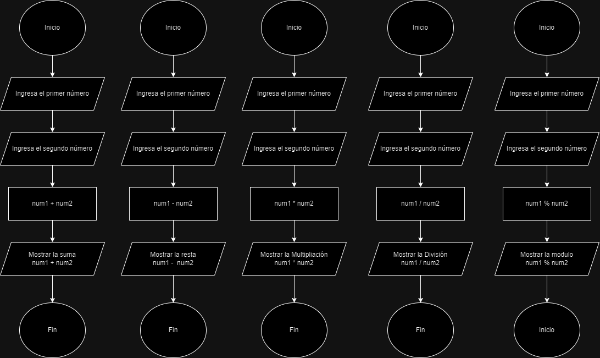

 # Uso de variables y operadores aritméticos
 
Este proyecto es un ejercicio para practicar el uso de variables y operadores aritméticos en JavaScript. Incluye un diagrama de flujo que representa la lógica del desafío.

## Vista del Diagrama de Flujo

A continuación, se muestra el Diagrama de Flujo:

 

 ## Autor

Este proyecto fue desarrollado por **Valeria Torrealba**.
